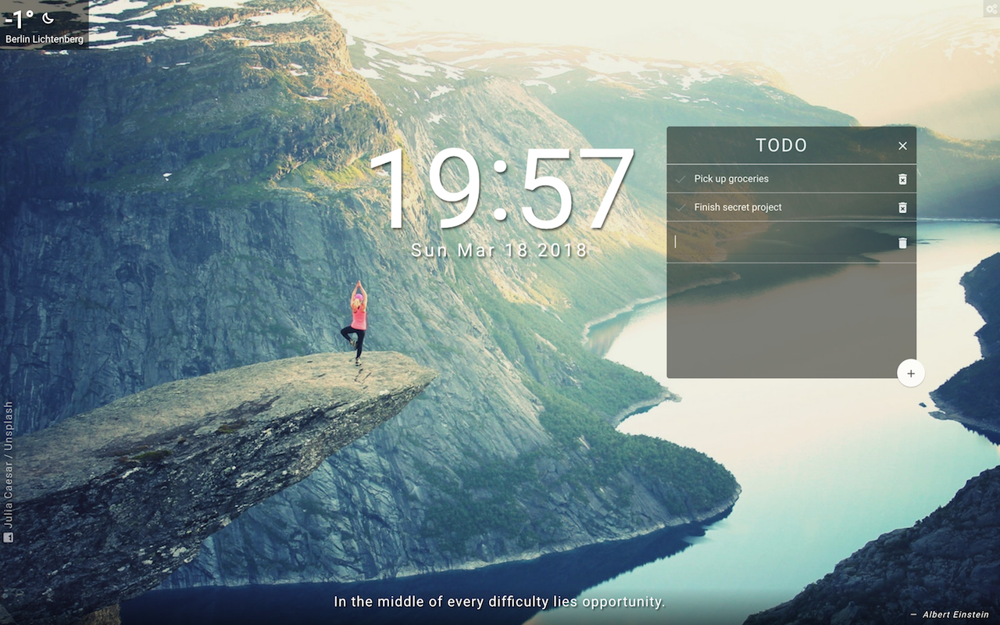
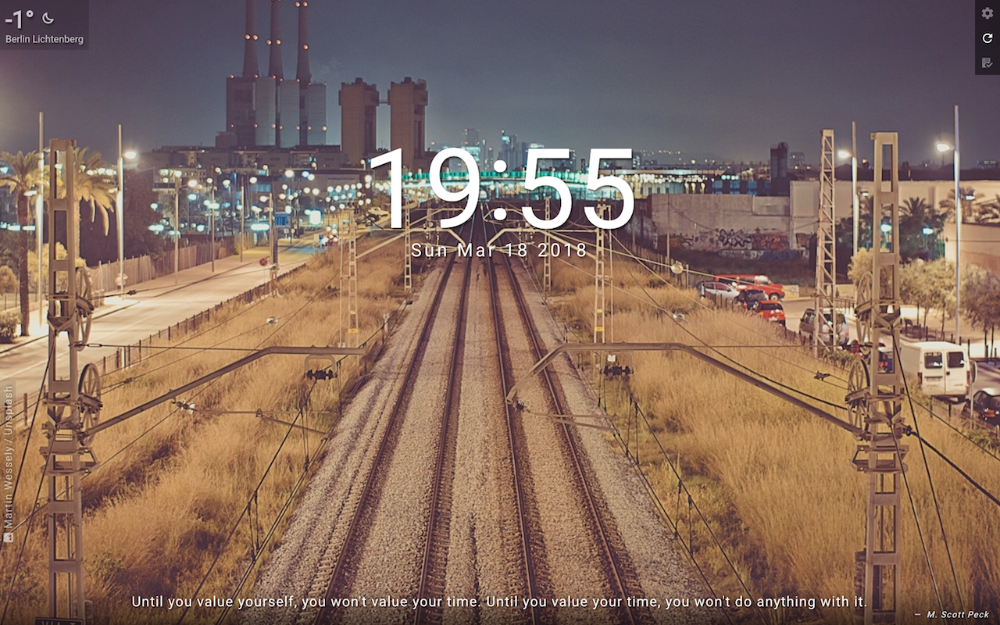
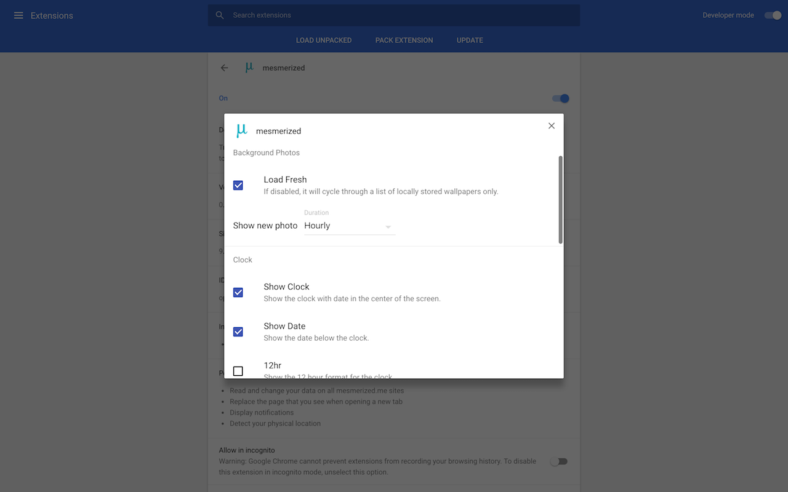

Browser Extension to give a fresh look to your new tab page, with beautiful backgrounds, inspirational quotes, weather forecasts, reminders, to-do lists and much more.

### Downloads

The extension is available for download for both Chrome and Firefox browsers from their respective web stores.
- [Chrome](https://chrome.google.com/webstore/detail/mesmerized/ieklodmmjfoaelcnfoilfcodkmicbooc)
- [Firefox](https://addons.mozilla.org/en-US/firefox/addon/mesmerized/)

### Screenshots









### Feature Modules

Following modules are available for now, more to come soon.

- Background Photos
- Quotes
- Weather
- Todo List
- Clock

### Project Details

This project was bootstrapped with [Create React App](https://github.com/facebookincubator/create-react-app), refer to original docs for build script details.

Install [watchman](https://facebook.github.io/watchman/docs/install.html) in order for tests to run. See [issue](https://github.com/facebookincubator/create-react-app/issues/871#issuecomment-252297884) for details.

```shell
npm install     # install dependencies
npm start       # starts dev server
npm build       # builds extension
```

Once the dev server has been started, visit
- http://localhost:PORT/tabpage.html for debugging tab page
- http://localhost:PORT/tabpage.html for debugging settings page

### Contributions

- Fork the project
- Commit your enhancements and bug fixes
- Create a pull request describing the changes

### License
mesmerized is released under the [MIT License](http://opensource.org/licenses/MIT).
